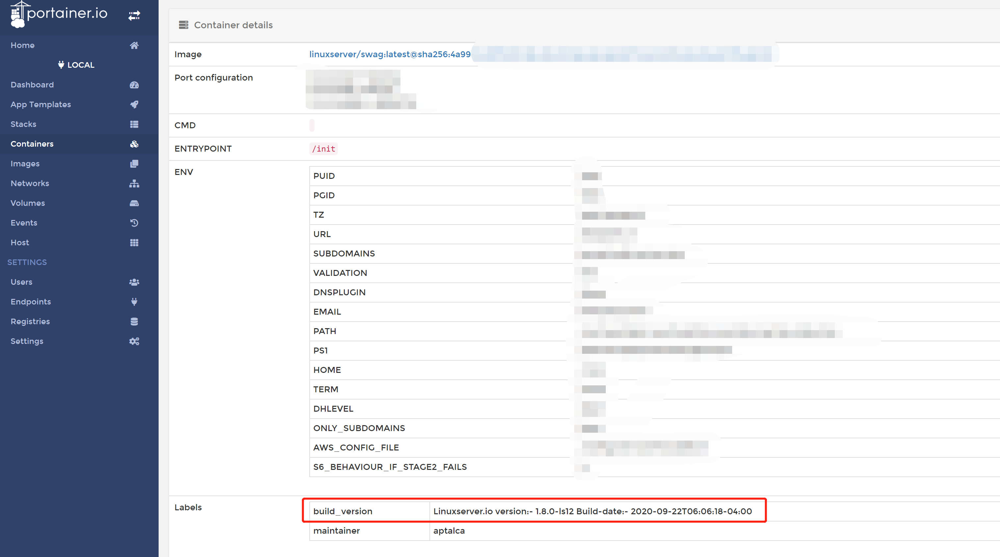

# 进入容器

在使用Docker的过程中，你也许会想要查看容器内部的数据。


## 进入容器内的Shell

在部署、调试容器的时候，经常会需要进入到容器内的Shell。

```shell
# 替换 <container_name> 为容器的名称
docker exec -it <container_name> /bin/bash
```


------

## 查看容器的日志（logs）

我们绝大多数的镜像都会把应用的运行日志输出到终端上，可以使用 `docker logs` 命令来查看：

```shell
# <number_of_lines_to_start_with> 替换为你希望查看日志的行数
# <container_name> 替换为容器名
docker logs -f --tail=<number_of_lines_to_start_with> <container_name>
```

默认情况下，docker会输出容器的所有日志，所以通过 `--tail` 参数来限制输出的日志行数。

为了更方便使用这条命令，也可以通过编辑 `~/.bash_aliases` 文件来自定义一条命令：

```shell
# ~/.bash_aliases
alias dtail='docker logs -tf --tail="50" "$@"'
```

之后只需要执行 `dtail <container_name>` 就可以了。


------

## 查看构建的版本号

如果您在使用的过程中遇到了某些问题，您可以把版本号反馈给我们，也许我们在已发布的新版本中解决了您的问题。当然如果您反馈给我们的已经是最新的版本号，那您可能发现了我们还未发现的问题。提供正确的版本号将有助于我们修复镜像的问题，也会更加方便解决您遇到的问题。

可以通过这条命令获取容器的版本号：

```shell
# 替换 <container_name> 为容器的名称
docker inspect -f '{{ index .Config.Labels "build_version" }}' <container_name> 
```

如果获取镜像的版本号，则是：

```shell
# 替换 <container_name> 为容器的名称
docker inspect -f '{{ index .Config.Labels "build_version" }}' linuxserver/<image_name>
```


------

>[!TIP]
>
>如果你已经按照 [Portainer-可视化管理Docker](before/portainer.md) 这篇文章所述安装了portainer，那么你也可以在容器的管理页面的“Container details”面板的“Labels”中看到容器的版本号

